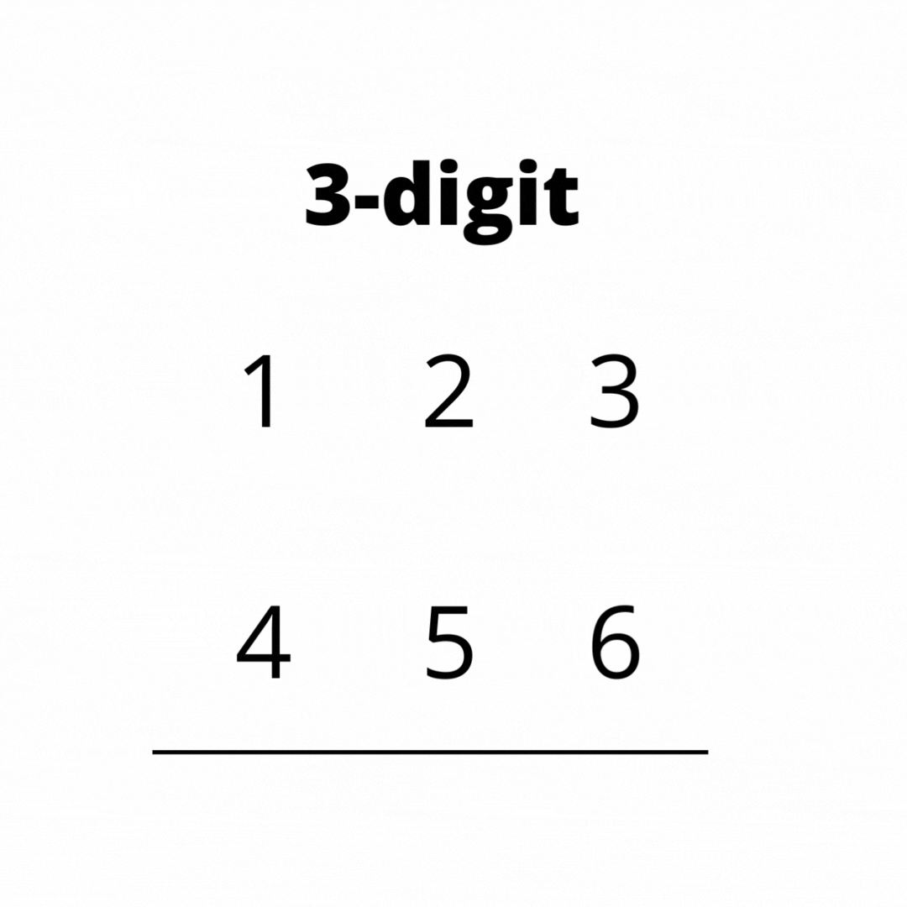

# Criss-Cross Multiplication 

The criss-cross multiplication algorithm multiplies large positive integers in string format. This algorithm is nearly twice as fast as the Karatsuba algorithm when the number of digits is below 1000.

Read more about the algorithm in this [post](https://creme332.github.io/creamy-notes/posts/criss-cross-multiplication/).

## Usage

## To-do

* [ ] Use object oriented approach
* [ ] Write tests
* [ ] Add github workflow
* [ ] add badges
* [ ] Release
* [ ] Store `sum` and `carry` as strings instead of long long data type. Then use addition and subtraction function for strings.

## References
